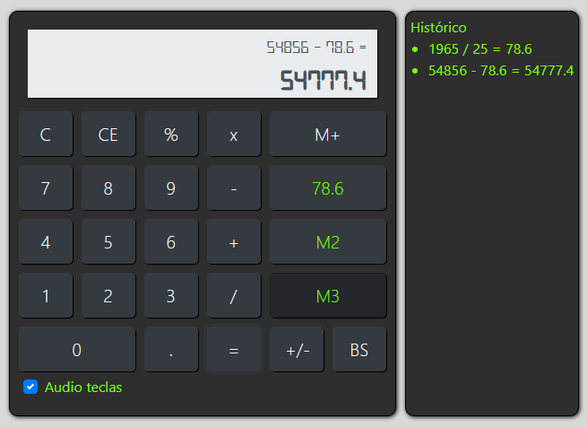

# Calculator
Clique na badge abaixo para acessae o Calculator on-line
 Caluladora on-line

 

 

Esta é uma calculadora web simples desenvolvida utilizando HTML5, CSS3 e JavaScript. Além das funcionalidades básicas de uma calculadora, neste projeto inclui alguns recursos como histórico de cálculos e opções para adicionar valores à memória, opção de habilitar o áudio das teclas, fonte caracterizada entre outras.

## Funcionalidades

- **Operações básicas:** Adição, subtração, multiplicação, divisão e porcentagem.
- **Memória:** Possibilidade de adicionar valores à memória e recuperá-los posteriormente.
- **Histórico de cálculos:** Registra os cálculos realizados durante a sessão atual.
- **Áudio das teclas:** Possibilidade em desabilitar o áudio das teclas, em default vem habilitada.

## Como usar

1. Faça o clone deste repositório ou baixe o arquivo zip.
2. Abra o arquivo `index.html` em seu navegador web.
3. Use a calculadora para realizar cálculos básicos.
4. Utilize os botões "M+" para adicionar valores à memória e as  teclas "M1" "M2" Ou "M3" para recuperá-los.
5. O histórico de cálculos é automaticamente exibido na lateral direita da calculadora.

## Contribuindo

Contribuições são bem-vindas! Se você deseja melhorar este projeto, sinta-se à vontade para abrir um problema ou enviar uma solicitação de pull request.

## Licença

Este projeto está licenciado sob a [MIT License](https://opensource.org/licenses/MIT).

